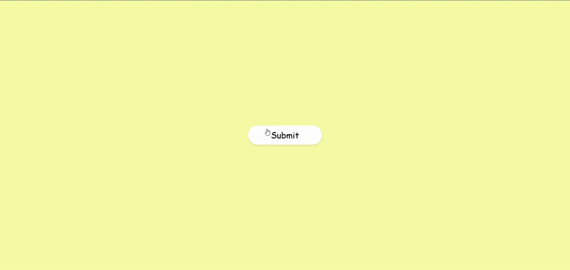
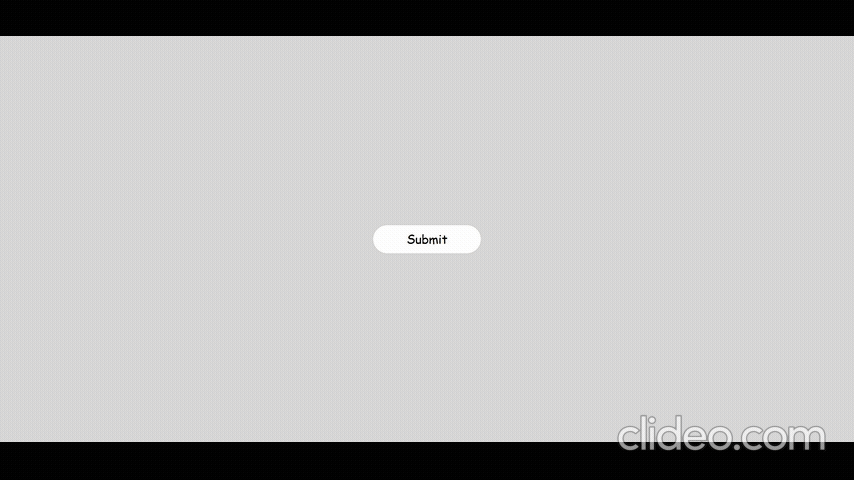
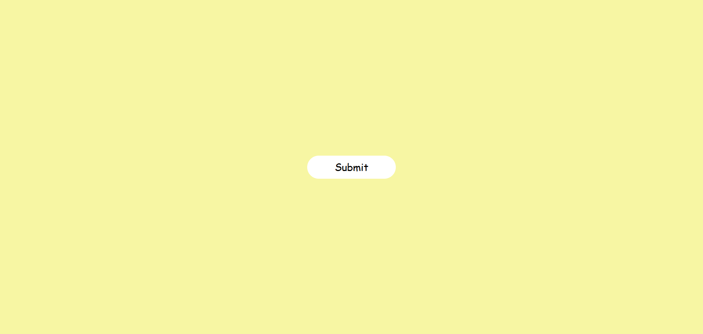
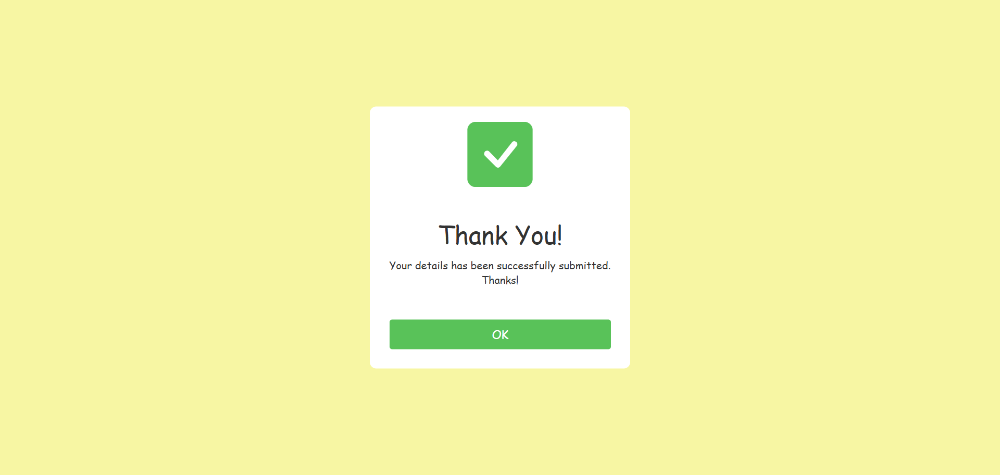
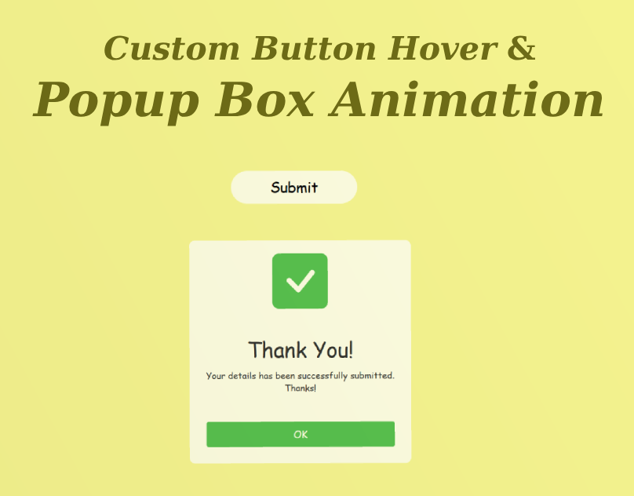

## Custom Button Hover and Popup Box Animation
<a href="https://www.linkedin.com/in/dharmendraverma95/" target="_blank">LinkedIn Profile </a>

<a href="https://www.behance.net/dhirukumar" target="_blank">Behance Profile </a>

## Project Overview

This project demonstrates how to create interactive button hover effects and an animated popup box using CSS and JavaScript. The button features hover animations, and upon clicking, a success popup box appears with an "Okay" button for user interaction. This project is ideal for enhancing user engagement on websites and web applications.

## Features
- Button Hover Effects: Smooth animations on hover to attract user interaction.
- Popup Box Animation: A stylish popup box that appears upon button click.
- Success Message: Display a success message in the popup box after an action.
- Okay Button: A simple "Okay" button that allows users to close the popup.
- Fully implemented using HTML, CSS, and JavaScript.
  

###### Lang
<ul>
  <li>HTML5</li>
  <li>CSS3</li>
  <li>Bootstrap Icon</li>
  <li>ChatGPT [For Content]</li>
  <li>ui / ui layout Design</li>
  <li>desgin in Abode XD</li>
</ul>

 
Desktop Design 

 
Desktop UI UX Design 

 
Desktop Design UI UX Layout 

 
Desktop Design 

Cover 
